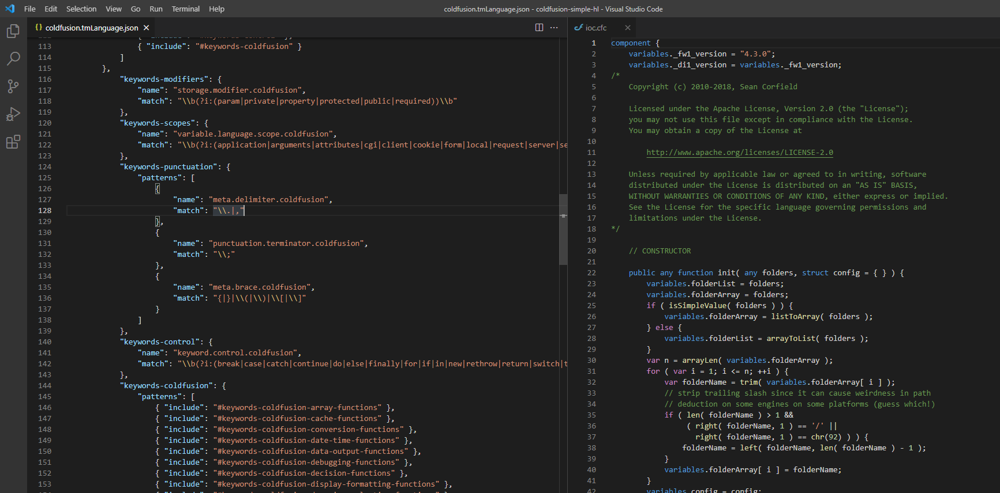

# coldfusion-simple-hl VS Code Extension

A simple/barebones ColdFusion grammar for the VS Code editor.

## Goals

* clear visual distinction for syntax highlighting
* fast
* semantically correct, to support other features of the grammar

## TODO

* clean up

## Reference Projects

* **VS Code Syntax Highlight Guide**
  * https://code.visualstudio.com/api/language-extensions/syntax-highlight-guide

* **Language Grammars - TextMate 1.x Manual**
  * https://macromates.com/manual/en/language_grammars

* **VS Code CFML**
  * https://github.com/KamasamaK/vscode-cfml

## Screenshot

### cfscript Grammar

### cfml Grammar

TODO
